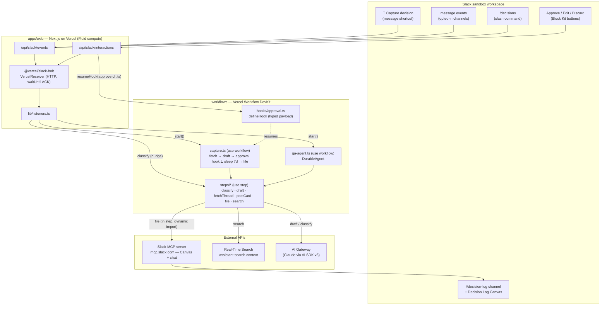

# Quorum — Architecture

> This diagram is the required hackathon **architecture diagram** artifact. It renders on GitHub.

## System



## Control-flow split (why hybrid)

| Flow | Primitive | Reason |
|---|---|---|
| Capture → approve → file | deterministic `"use workflow"` | Linear human-in-the-loop; durable suspend-for-approval (hours at zero compute) is the whole point. Demo-safe. |
| "what did we decide about X?" | `DurableAgent` | Branching reasoning (records-first vs RTS-over-raw-threads) is genuinely agentic. |

## Key durability + safety properties

- **3-second Slack ACK** via `@vercel/slack-bolt` `waitUntil` + Fluid compute; work continues in the background workflow.
- **Approval expiry**: `Promise.race([approvalHook, sleep("7d")])` — verified by an integration test.
- **MCP client only in steps**: `@ai-sdk/mcp` is dynamically imported inside the `"use step"` body so it never enters the sandboxed workflow VM (the bundler inlines the static graph).
- **Narrow subpath exports** on `@quorum/slack` keep `node:crypto` (signature verify) out of every workflow graph.
- **Permission scoping**: RTS returns only what the calling user can see; proactive detection runs only in app-present, opted-in channels.

## Module boundaries

```
packages/shared  ── pure: DecisionRecord schema, Block Kit + Canvas formatters, citations
packages/slack   ── I/O clients: verify (crypto), rts (fetch), mcp / mcp-client (@ai-sdk/mcp)
workflows        ── orchestration: capture (use workflow), qa-agent (DurableAgent), steps (use step), hooks
apps/web         ── edge: Bolt receiver, listeners, routes, health
```
